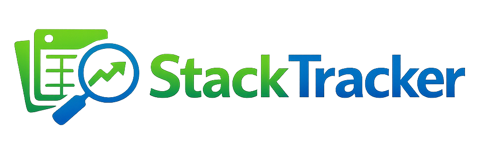
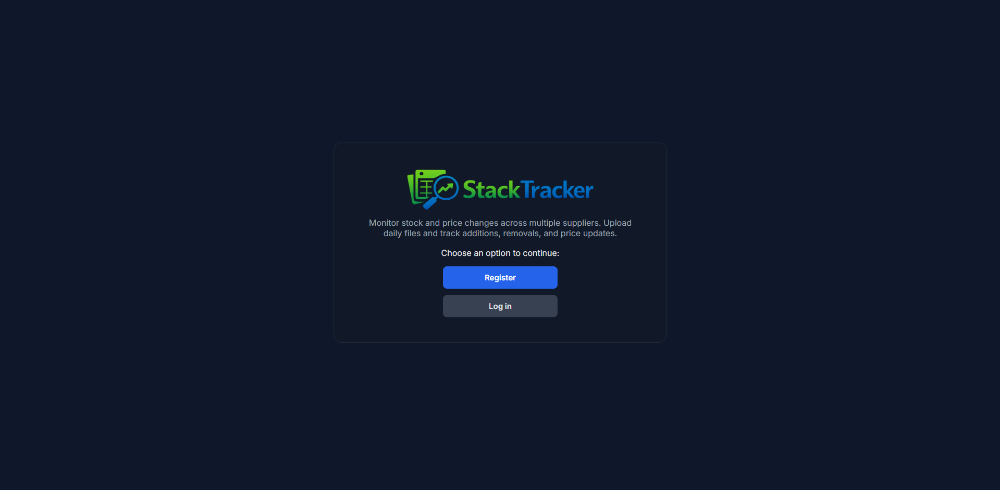
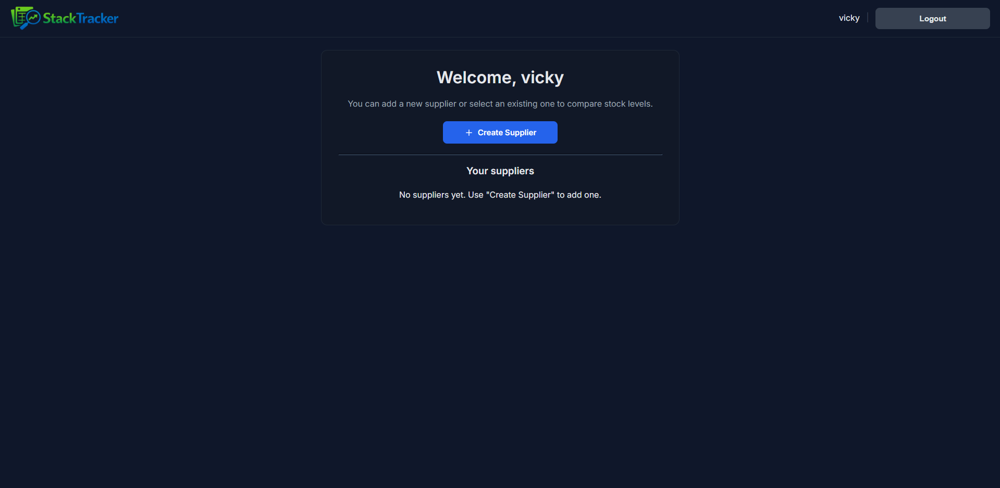
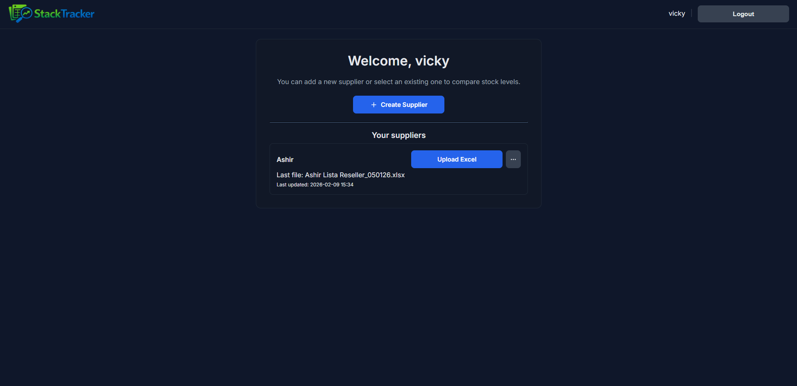
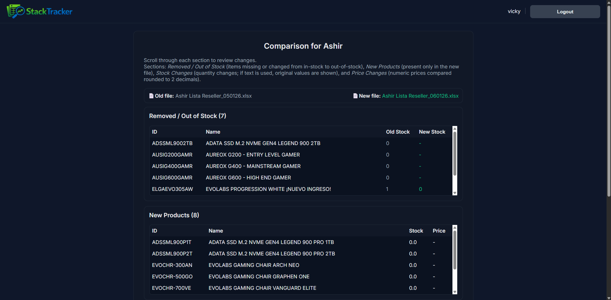
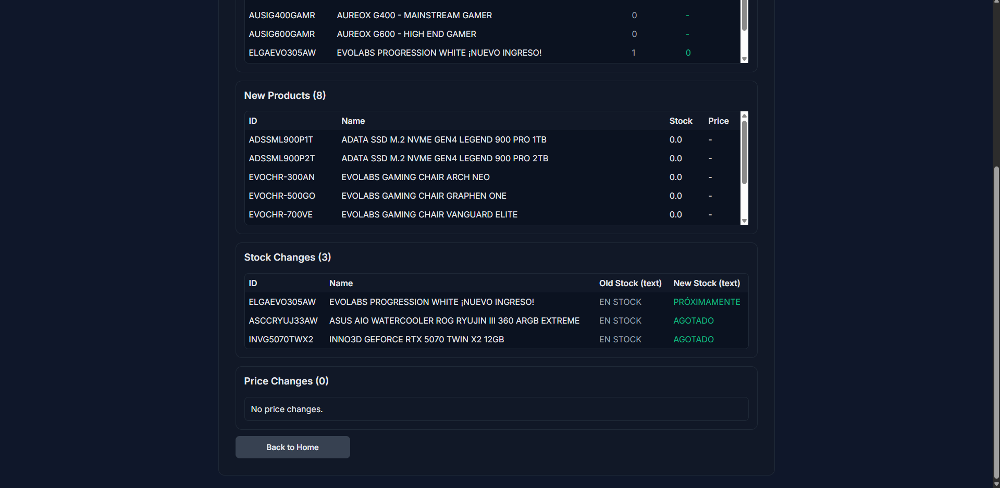

# StackTracker



## Table of Contents
- [Overview](#overview)
- [Technologies Used](#technologies-used)
- [Requirements](#requirements)
- [Local Use (Docker)](#local-use-docker)
- [Demo](#demo)

## Overview
StackTracker is a web application designed to help small businesses monitor daily stock and price changes from multiple suppliers.

The system allows users to configure supplier-specific Excel schemas, upload daily stock files, and automatically detect product additions, removals, and price updates.

StackTracker focuses on simplicity and clarity, providing a clean interface for non-technical users while maintaining a well-structured backend architecture suitable for scaling.

## Technologies used
- **[Django](https://www.djangoproject.com/)**: Web development framework that follows the Model–View–Controller design pattern.
- **[PostgreSQL](https://www.postgresql.org/)**: Relational database management system.
- **[Docker](https://www.docker.com/)**: Platform for containerization and service deployment.
- **[Pandas](https://pandas.pydata.org/)**: Python library specialized in data manipulation and analysis.

### Requirements
- Python 3.12+
- Docker + Docker Compose

### Local use (Docker)

```bash
# Build and start Postgres + Django app
chmod +x entrypoint.sh
docker compose up --build

# App will be available at
# http://localhost:8000/
```

## Demo
Below are several screenshots showcasing key parts of the application:









